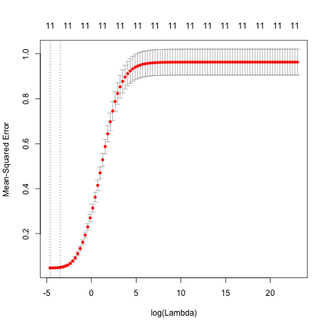

#Abstract

This report aims to find a predictive modelling process for the Credit balance. The data analysis focuses on ten different factors that could influence credit card balance. We use five different models of regression such as exploratory data analysis, pre-modeling data processing and multiple linear regression models in order to make a decision on which of the methods is the best predictor for the balance in terms of ten predictors such as Income, Age, Education, Gender and others. 


#Introduction

   In this project we focus on the five regressions learned such as Least-Squares regression, Ridge regression, Lasso regression, Principal Component regression, and Partial Least-Squares regression. We approach the project by considering these types of regression, so that we can compare them for the simple purpose of improving the accuracy of the predicion of the linear model in this case. By using other models this will make the coefficient of the other variables equal to zero and during our analysis, the whole process will be more efficient because there will be less variables to interpret and easier visually. 
   
Another reason to use different kind of methods is that not every variable is connected with the response variable. To avoid using least-square method, we use other models that will set the coeff. equal to zero and making our analysis easier to interpret. Other methods include ridge, lasso, partial least square and principal component. They would all go towards the same value but the way to reach that would be different depending on method. 

Before running any kind of regression in the dataset, we first focus on the exploratory data analysis by observing and reproducing mediums of visualization like statistical diagrams, histograms, graphs. This could affect on our ability to evaluate each regression's performance. 

The reproducibility and collaborativeness included in the project is vital not only to an eloquent flow of our progress but also on the results we get at the end. Just like we were able to analyse, produce and observe patterns in our project, other users may find this helpful and contribute to the advancement of project in the future. This comes as a result of  collaborative efforts from both parts. 

The variables used in this dataset are qualitative {Gender, Student, Married, and Ethnicity} and quantative {Income, Limit, Rating, Cards, Age, Education, and Balance}. We are using data that originated from Credit.csv. The quantitative variables in this are labeled as age, cards, education, income, limit, rating, and balance. These variables are one's age, the no. of credit cards one has, years of education, income in dollars, credit limit, credit rating, and one's average credit card debt. Balance is the response variable.  

One important part of our job was to standardize all of the data for a more comprehensibile and easier approach. For our analysis, based on the Credit.csv, we created scaled-credit.csv, which has the same variables as the original file. However, not every content is the same since we can still make changes to scaled-credit.csv, especially depending to the scale variables are measured in this case. 

#Methods

### Ordinary Least Squares Regression
Apply multiple linear regression by using the **lm()** function to find the relationship between Balnace and the 11 predictors of Income, Limit, Rating and more. 

$$Result = \beta_{0}+\beta_{1} * Income + \beta_{2}*Limit + \beta_{3}*Rating + \dots + \beta_{10}*EthnicityCaucasian $$

### Shrinkage Methods

### Ridge regression
Ridge regression is similar to OLS with the coefficients estimated by minimizing a slightly different quantity.By minimzing RSS, we can find the coefficient estimates that fit the data well.
$$\sum_{i=1}^{n}(y_i-\beta_0-\sum_{j=1}^{p}\beta_jx_{ij})^2+\lambda\sum_{j=1}^{p}\beta_j^2 = RSS + \lambda\sum_{j=1}^{p}\beta_j^{2}$$
However, the shrinkage penalty is that $\lambda\sum_{j=1}^{p}\beta_j^{2}$ is small when $\beta$ are close to zero. Ridge regression will produce a different set of coefficient estimates for each value of $\lambda$ .

## Lasso regression
Lasso also minimize the quantity by the following:
$$\sum_{i=1}^{n}(y_i-\beta_0-\sum_{j=1}^{p}\beta_jx_{ij})^2+\lambda\sum_{j=1}^{p}|\beta_j| = RSS + \lambda\sum_{j=1}^{p}|\beta_j|$$
Lasso also shrink the coefficient estimates to zero. However, the penalty has the effect of focing some of the coefficient estimates to equal to zero when the tuning pararmeter is too large. Thus, lasso is better on feature selection.

##Dimension Reduction Methods

### Principal Components regression (PCR)
In principal compoenents regression, the method is construct $Z_1 + \dots + Z_{M*}$ and then use these components as the predictors in a linear regression model. With the small amount of principal components, it can explain the variability of the data. PCR performs well when the first few principal components have enough information on the variation in the predictors and relationship with the response. The response does not supervise the principal components.

### Partial Least Squares regression (PLSR)
Partial Least Square is a supervised way of PCR. PLS is a dimension reduction method and fits a linear model through least square using $Z_1 + \dots + Z_{M*}$ . PLS also make use of response Y to identify new features. PLS will try to find ways to explain the trend and pattern of reponse and predictor variables.

##### Credit to An Introduction to Statistical Learning

#Analysis

```{r}
library(xtable)
library(readr)
library(Matrix)
options(xtable.floating = FALSE)
load('../data/ols.RData')
load('../data/ridge.RData')
load('../data/lasso.RData')
load('../data/pcr.RData')
load('../data/plsr.RData')
```

## OLS
```{r,echo=FALSE,results='asis'}
olsTable <- xtable(olsSum$coefficients)
print(olsTable, comment=FALSE, type = "latex")
# OLS MSE
olsMSE
```

The ordinary least squares regression MSE is 0.04478619. 

## Ridge 

```{r,echo=FALSE,results='asis'}
ridgeTable = as.matrix(ridgeFitcoef)
print(xtable(ridgeTable), comment = FALSE,type = 'latex')
ridgeMSE
```

The ridge regression MSE is 0.0525927.
When comparing the ridge regression with OLS, the results are similar.

## Lasso 

```{r,echo=FALSE,results='asis'}
lassoTable = as.matrix(LassoFitcoef)
print(xtable(lassoTable), comment = FALSE,type = 'latex')
lassoMSE
```

The lasso regression MSE is 0.05154446
The lasso regression and ridge regression have the same results.

## Principal Components Regression

```{r,echo=FALSE,results='asis'}
pcrTable = as.matrix(pcrFitCoef)
print(xtable(pcrTable), comment = FALSE,type = 'latex')
pcrMSE
```

The PCR MSE is 0.05199678.
The PCR coefficients and OLS coefficients are similar. They also shared the similar results with ridge regression. 

## Partial Least Squares Regression

```{r,echo=FALSE,results='asis'}
plsrTable = as.matrix(plsrFitCoef)
print(xtable(plsrTable), comment = FALSE,type = 'latex')
plsrMSE
```

The PLSR MSE is 0.0517916.
The PLSR coefficients have some difference from PCR. When comparing with second and third components, PCR and PLSR have different results. The majority others remains the same. 


From the analysis, we can see that the MSE are similar to each other. The OLS has the smallest MSE, which is the best fit model for the credit data set. The ridge regression has the largest MSE among the five regression, which is the least efficient model. From the tables above, most of the coefficients are similar except for PLSR. 

In the Lasso Regression, the Education, Gender female, Ethnicity Asian and Ethnicity Caucasian, Married Yes are 0 for the coefficient. The regression is trying to minimize the predictors.




When comparing the cross validation on both ridge and lasso, lasso cross validation is less consistent than ridge cross validation.

# Conclusions
This project uses five regression model to determine the best fit model for the Credit dataset. Based on the result, the OLS perform the best among all the models. The second best is the lasso regression. However, the MSE among all models are very similar and they shared similar coefficients. That means none of the models is far off from the rest. 

#Credit
An Introduction to Statistical Learning: With Applications in R. New York: Springer, 2013. Print.